# Cleanup Notes Plan

## Objective

Populate [docs/cleanup_notes.md](docs/cleanup_notes.md) with findings from reproducing TPU benchmarks on v4 and v5p, then determine what can be cleaned up. GPU-related code stays as-is.

---

## Phase 1: Document Structure for cleanup_notes.md

The note will be structured as:

1. **Executive summary** – What can be removed, what must stay
2. **V4 hardware** – Required parts, preparation steps, benchmark commands
3. **V5P hardware** – Required parts, preparation steps, benchmark commands
4. **Cleanup recommendations** – Directories/files safe to remove

---

## Phase 2: V4 Hardware (Steps 0–4)

### Step 0: Preparation

- **Script:** `bash preparation/clone_repos.sh`
- **Required repos:** `tpu-inference` (root), `vllm` (root) – both needed for benchmarks
- **Branch requirements:** DFlash needs `dflash-integration` (tpu-inference) and `dflash-speculative-config` (vllm); baseline can use `son_dev` / main
- **Environment:** Uses Docker (`vllm/vllm-tpu:latest`) – no host venv for v4
- **Reference:** [docs/01_tpu_setup_guide.md](docs/01_tpu_setup_guide.md)

### Step 1: Standalone TPU benchmark

- **Entry:** [benchmarks/standalone_dflash.py](benchmarks/standalone_dflash.py)
- **Run:** `bash tests/standalone_benchmark.sh` (uses [tests/lib/docker_run.sh](tests/lib/docker_run.sh))
- **Output:** Writes to `/output` (mounted from `HOST_OUTPUT_DIR` = `/dev/shm/dflash-test-outputs`)
- **Copy to results:** Manually copy JSON to `results/v4/standalone_<dataset>.json`
- **Required parts:**
  - `tpu-inference/` (PYTHONPATH), `benchmarks/standalone_dflash.py`, `tests/standalone_benchmark.sh`, `tests/lib/common.sh`, `tests/lib/docker_run.sh`

### Step 2: vLLM pipeline benchmark

- **Entry:** [verification/contribution/sh/run_contribution_matrix.sh](verification/contribution/sh/run_contribution_matrix.sh) → [verification/contribution/py/run_matrix.py](verification/contribution/py/run_matrix.py)
- **Run:** `bash tests/benchmark.sh math` (or `code`, `chat`, `full`, `eagle3_qwen3`)
- **Config:** [tests/configs/benchmark_math.json](tests/configs/benchmark_math.json)
- **Output:** `/dev/shm/dflash-test-outputs/<RUN_ID>/summaries/`
- **CSV generation:** `python results/v4/generate_csvs.py` reads `/dev/shm/dflash-test-outputs/bench_math_*/` and writes `results/v4/vllm_pipeline_results.csv`
- **Required parts:**
  - `tpu-inference/`, `vllm/` (both in PYTHONPATH), `verification/contribution/`, `tests/benchmark.sh`, `tests/configs/`, `results/v4/generate_csvs.py`

### Step 3: GPU – keep as-is

### Step 4: V4 required parts summary

- **Dirs:** `tpu-inference/`, `vllm/`, `benchmarks/`, `tests/`, `verification/contribution/`, `results/v4/`, `preparation/clone_repos.sh`
- **Config:** `tests/configs/*.json`, `verification/contribution/manifests/*.json`
- **Output:** Results are manually copied from `/dev/shm/` into `results/v4/`

---

## Phase 3: V5P Hardware (Steps 0–4)

### Step 0: Preparation

- **Scripts:**  
  1. `bash preparation/setup_v5p_safe.sh` (venv, JAX, device setup for v5p)
  2. `bash preparation/clone_repos.sh`
- **Reference:** [preparation/V5P_SETUP_MANUAL.md](preparation/V5P_SETUP_MANUAL.md)
- **Note:** `run_all_v5p_pr.sh` hardcodes `/home/aaronfeng/tpu-spec-decode` – should use `REPO_ROOT` or `$PWD`

### Step 1: Standalone benchmark

- **Same entry:** `benchmarks/standalone_dflash.py`
- **V5P batch script:** [benchmarks/run_all_v5p_pr.sh](benchmarks/run_all_v5p_pr.sh) – runs 9 datasets, outputs to `/dev/shm/dflash-test-outputs/v5p-pr/`
- **Copy to results:** Manually copy to `results/v5p/standalone_<dataset>.json`

### Step 2: vLLM pipeline benchmark

- **Same:** `bash tests/benchmark.sh math` – same Docker flow as v4
- **Result location:** v5p does not yet have `generate_csvs.py`; vLLM outputs go to `/dev/shm/` and would need a v5p-specific CSV generator or a copy of `results/v4/generate_csvs.py` adapted for `results/v5p/`

### Step 3: GPU – keep as-is

### Step 4: V5P required parts summary

- **Dirs:** Same as v4, plus `preparation/setup_v5p_safe.sh`, `preparation/V5P_*.md`
- **Script:** `benchmarks/run_all_v5p_pr.sh` (needs path fix)

---

## Phase 4: Cleanup Recommendations

After documenting required parts for v4 and v5p, the note will list **removable** items:

| Category                 | Candidates for removal                                                                                                                                                |
| ------------------------ | --------------------------------------------------------------------------------------------------------------------------------------------------------------------- |
| **Symlinks/dirs**        | `report`, `.Claude`, `brainstorm-00-core`, `brainstorm-20-spec-decode-diffusion`, `dflash-wide`, `pr-ready`, `zhongyan_dev`, `slides`, `visualizations` (if not used) |
| **clone_repos groups**   | Groups 2–7 (zhongyan_dev, pr-ready, external, dflash-wide, brainstorm, slides) – only Group 1 (tpu-inference, vllm) needed for benchmarks                             |
| **External**             | `external/dflash` optional (synthetic prompts if missing); other externals only for reference                                                                         |
| **Verification outputs** | `verification/outputs/` – historical run artifacts, can be pruned                                                                                                     |
| **Capstone/report**      | `capstone_report/`, `results/report.md` – keep if part of deliverables                                                                                                |
| **V4-specific**          | `results/v4/quality_*.json`, `profiling_*.json`, `verify_context_scaling.json` – keep if used for analysis                                                            |

---

## Phase 5: Execution Flow (for the note)

```mermaid
flowchart TD
    subgraph v4 [V4 Hardware]
        A0[bash preparation/clone_repos.sh]
        A1[bash tests/standalone_benchmark.sh]
        A2[bash tests/benchmark.sh math]
        A3[Copy outputs to results/v4]
        A4[python results/v4/generate_csvs.py]
    end
    subgraph v5p [V5P Hardware]
        B0[bash preparation/setup_v5p_safe.sh]
        B1[bash preparation/clone_repos.sh]
        B2[bash benchmarks/run_all_v5p_pr.sh OR tests/standalone_benchmark.sh]
        B3[bash tests/benchmark.sh math]
        B4[Copy outputs to results/v5p]
    end
    A0 --> A1 --> A2 --> A3 --> A4
    B0 --> B1 --> B2 --> B3 --> B4
```

---

## Deliverables

1. **docs/cleanup_notes.md** – Full note with:
  - Empty placeholder initially (per user request)
  - Structure ready for manual fill-in after runs
  - Or populated with the above findings as template content
2. **Fix for run_all_v5p_pr.sh** – Replace hardcoded `/home/aaronfeng/tpu-spec-decode` with `$(cd "$(dirname "$0")/.." && pwd)` or `REPO_ROOT`

---

## Open Questions

1. Should `docs/cleanup_notes.md` start empty (user fills after runs) or with the above template?
2. Is `visualizations/` needed (reads from `results/v5p/`, `results/v4/`) – keep or remove?

